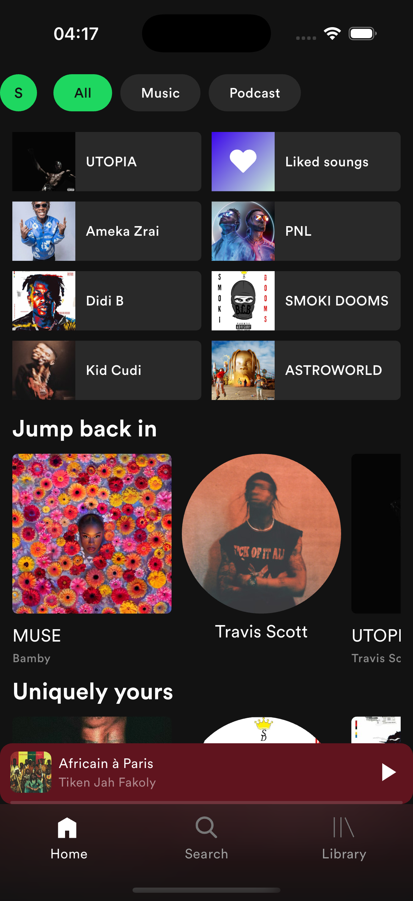
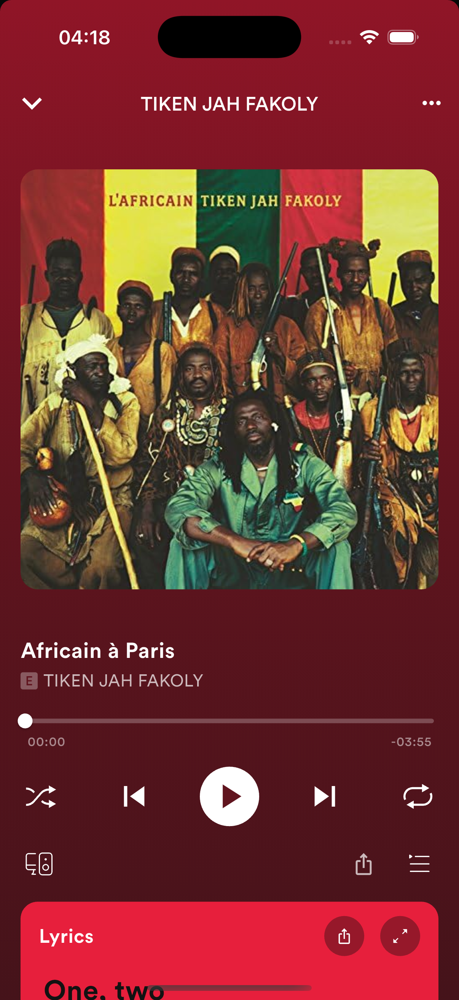
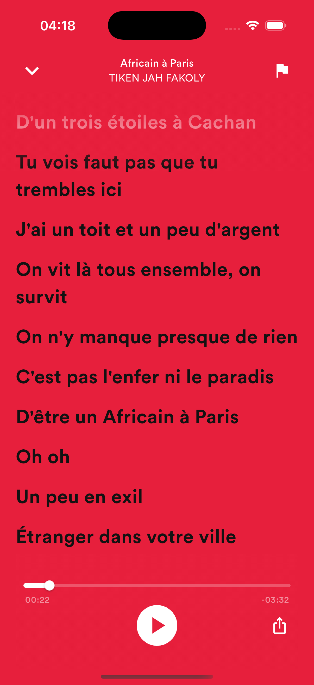

# Spotify Clone

A Flutter app inspired by the Spotify interface.  
⚠️ **Note:** This project is still in progress and not fully complete.

## Features

- Home screen with playlists and artists
- Audio playback
- Synchronized lyrics page
- Responsive UI
- Dark theme

## Screenshots

  



## Getting Started

1. Clone the repository:
```bash
git clone https://github.com/your-username/spotify_clone.git
cd spotify_clone
```

2. Install dependencies:
```bash
flutter pub get
```

3. Run the app:
```bash
flutter run
```

## Main Dependencies

- GetX
- just_audio
- flutter_svg
- scrollable_positioned_list

## Author

Souleymane Diomande
